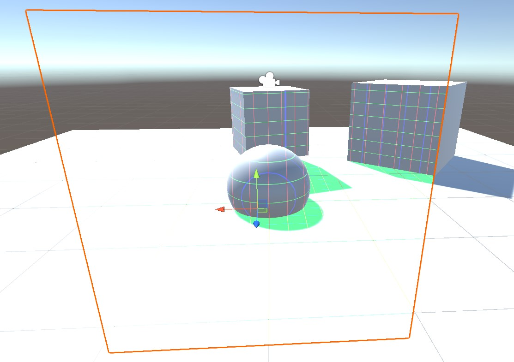
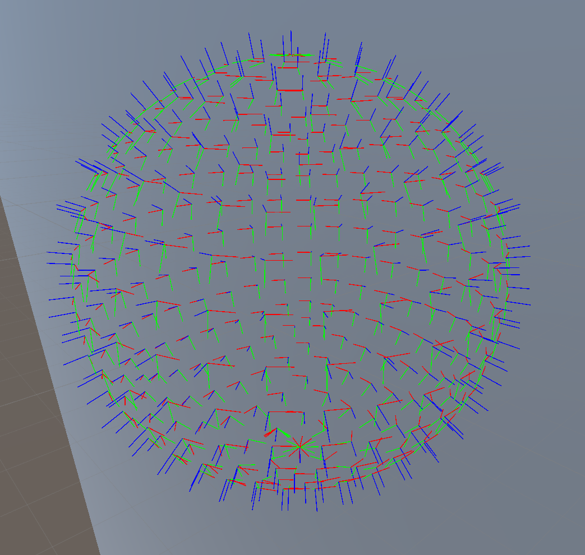

# Lereldarion Unity Shaders
Collection of useful Unity Shaders, made for VRChat, but not dependent on its SDK.

Install using VCC at https://lereldarion.github.io/vpm-listing/.

Install from Unity Packages from [releases](https://github.com/lereldarion/unity-shaders/releases).

## Overlays
These overlay shaders are useful on avatars for world analysis (wireframe, normals, HUD), or adjusting lighting (GammaAdjust).

They all support an `_Overlay_Fullscreen` toggle to make them take the entire field of view of the camera ; useful for first person view without clipping problems.
If you use this toggle, **animate it only locally** using the `IsLocal` VRChat parameter, to avoid annoying other users.
Note that this fullscreen effect only works if the mesh renderer is not culled by Unity, so ensure that the mesh bounds are in view of the player camera.
On avatars, this toggle ignores the mirror instances and only works on the player camera to not be annoying.

The `Demo` scene demonstrate their use on a dummy scene.

`Materials` contains pre-instantiated material assets for convenience.
They are equivalent to materials generated by doing *right click → create → material* on the given shader.

### Gamma Adjust
Adjust the gamma of the scene image behind it, like a post process effect.
Uses a `GrabPass`.

This is very useful to simulate low-light vision in dark spaces (without a dynamic light !), or decrease luminosity in worlds that are too bright.

### Depth Scene Reconstruction : Grid / Normals / Wireframe
These 3 overlays reconstruct the position of the scene pixels, and use it for various display effects :
- `Grid` overlays a 1m (dependent on Zoom) world space grid on the scene objects, along X/Y/Z planes
- `Normals` shows the world space normals of the actual triangle geometry of the scene (without the normal maps !), color coded
- `Wireframe` displays scene triangles with white edges on dark

All of these overlays use the `_CameraDepthTexture`, a unity feature to access the depth of scene pixels.
This texture is only available if required by the render pipeline, usually if a realtime dynamic light with shadows is present on the scene.
For worlds without dynamic light and shadows, you can force `_CameraDepthTexture` by adding a light on your avatar at the cost of avatar Rank : https://github.com/netri/Neitri-Unity-Shaders?tab=readme-ov-file#types.
I personnaly choose to not put a light on my avatars for performance reasons (they are really bad !), and accept that the `_CameraDepthTexture` is not always available.

These shaders are inspired by similar ones from https://github.com/netri/Neitri-Unity-Shaders, but they have been improved to be more numerically precise and do not use any `GrabPass`.

#### Grid

#### Normals

#### Wireframe

### HUD
This shader shows various world positionning data in a fighter jet like HUD with emission :
- world position X/Y/Z in meters
- world rotation, azimuth and elevation
- a range in meters to the object pointed by the central crosshair, if the `_CameraDepthTexture` is available (see note for depth).

The HUD displays like a skybox that is anchored to the object on which the shader is applied ; like a [reflector sight](https://en.wikipedia.org/wiki/Reflector_sight).
The central crosshair will we aligned with the surface normal vector.
This works well on a simple quad.
For more complex geometries, you must ensure that all triangles have the same normal and tangent vectors ; this can be done with custom normals in blender.

Distances and positions are limited to 4 digits, but any world with world positions above a few kilometers are unpleasant due to floating point numerical errors.

This shader requires a texture for the digits, but due to the SDF strategy it only costs 10kB of VRAM (128x128) while still being sharp.

## Debug Lighting
Apply to any mesh (only 1 vertex required), and it will display lighting configuration elements that touch the mesh renderer as gizmos in the world :
- Unity realtime lights : pixel directional / point / spot lights, vertex point lights, colored by the light color.
- Unity reflection probes : displays the bounding boxes and their center, with a sphere to show the raw cubemap. Color of the lines shows the blend factor when 2 probes are active.
- Unity light probes : sphere with lighting values applied to it. Positions are not available in the shader so they cannot be displayed.
- [LTCGI](https://github.com/PiMaker/ltcgi) v1 : emitting surfaces as rectangle edges + diagonals. A normal line at center. Solid lines. Color is item index.
- [Light Volumes](https://github.com/REDSIM/VRCLightVolumes) v2 :
    - volume bounding boxes, dashed lines (dash size is texture resolution). Color hue represents indexes.
    - lights with simpler dashed patterns compared to unity equivalents. Color is the light color. Dash size is 1m and line lengths indicate culling distance. Display light cookies on spheres if used.

## Debug TBN
Applied to mesh, this shaders displays the tangent space at each vertex as small 3D lines.

## Hidden
Material that does not render the triangles.

This is useful to fill material slots that cannot be disabled by animators on avatars (skinned mesh slots).
