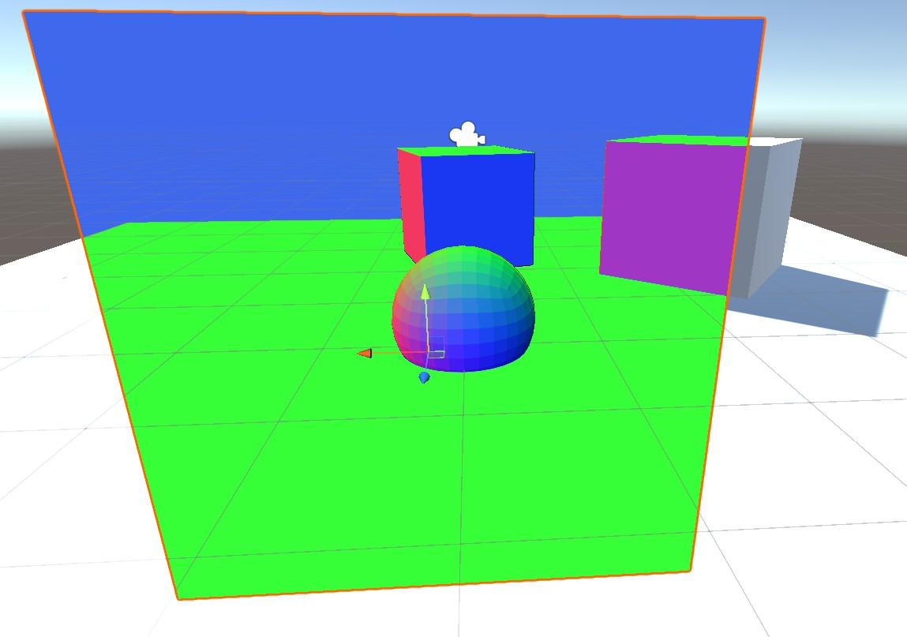

# Lereldarion Unity Shaders

Install using VCC at https://lereldarion.github.io/vpm-listing/.

Install from Unity Packages : see [releases](https://github.com/lereldarion/unity-shaders/releases).

## Overlays
Detailed [documentation](Packages/lereldarion.unity-shaders/Runtime/Overlays/Readme.md).

Grid / Normals / Wireframe are based on the well known ones from https://github.com/netri/Neitri-Unity-Shaders, but with improvements in precision and removal of `GrabPass`.

### Overlay Gamma Adjust
Adjust gamma of the scene, useful to deal with dark or excessively bright lighting.

### Overlay Grid
Overlays a 1m worldspace grid onto the world.

### Overlay Normals
Displays color-coded worldspace normals of triangles in the scene.

### Overlay Wireframe
Display scene triangles as white edges on black.

### Overlay HUD
Displays a HUD with various worldspace information : azimuth, elevation angle, position, range to target in the crosshair.

